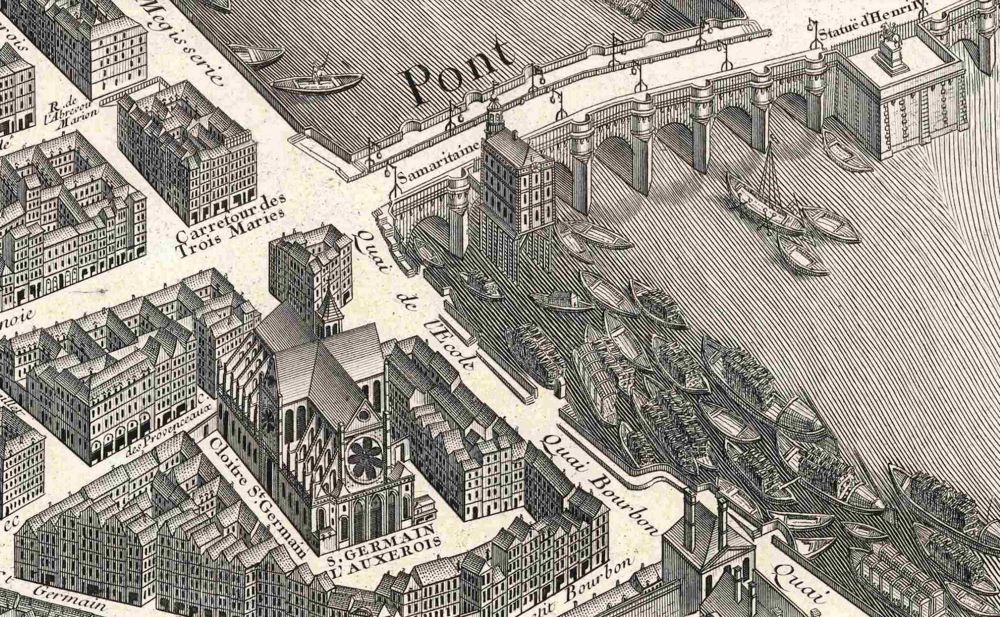

# Turgot Three.js

## Building the Turgot map of Paris in 3D for the web.

[The Turgot map of Paris](https://en.wikipedia.org/wiki/Turgot_map_of_Paris) is a detailed representation with perspective of the city in the 18th century. This project aims to create a 3D version of this map for the web using [Three.js](https://threejs.org/), allowing users to explore it in a new way.

## Project documentation

- [Workflow from QGIS to Blender to GLB](./project/workflow-qgis-to-glb.md)

## Website

- [www.turgot3d.fr](https://www.turgot3d.fr/)
