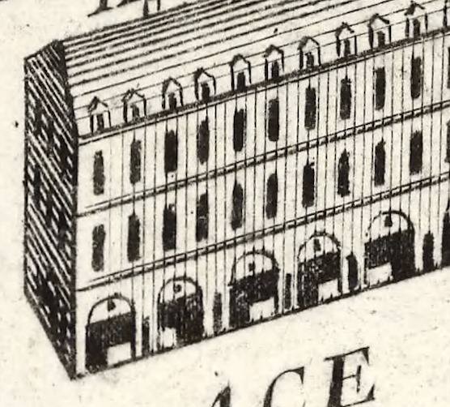

# Facade Windows — Plan & Blender Guide

Companion to [procedural-shader-architecture.md](./procedural-shader-architecture.md).
First real surface layer on top of the shared paper base: **rectangular windows on
facades**, starting with Place Dauphine but reusable for every building.



---

## Decisions from the design conversation

- **Scope of the first pass:** rectangular window grid only. No arcade, dormers, or
  doors yet — validate the coordinate + grid system first.
- **Coordinate source:** normalized per-wall UV + a per-wall size attribute
  (primary), **with a fully procedural fallback** so windows still draw when the
  model carries no data.
- **What goes in the model:** per-**wall** data only (a UV map + one `vec2` size).
  Never per-window data. Window pitch, floor height, sizes, ink color, jitter all
  stay as live GUI uniforms.
- **Routing is unchanged:** the `facade` material name already routes to the facade
  shader (`src/shaders/replaceMaterial.ts`). Any mesh with a `facade` material gets
  windows automatically.

---

## The core problem

The paper base gives `surfaceLayers` a **paper/screen-space** uv — perfect for grain
continuity, useless for placing windows. To draw "3rd column, 2nd floor" a fragment
needs a **per-wall frame**: horizontal position along the wall + height. Place
Dauphine's mesh currently has `POSITION` + `NORMAL` only (no UVs), so that frame does
not exist yet.

We solve it with two paths in one shader, chosen per material by a `uHasWallData` flag:

### Primary path (needs Blender data)

Each wall is unwrapped to `UV ∈ [0,1]²` and carries a constant per-wall attribute
`aWallSize = (lengthMeters, heightMeters)`. The shader fits an **even, centered** grid:

```glsl
float columns = max(1.0, round(lengthMeters / uWindowPitch));   // pitch ~4 m
float floors  = max(1.0, round(heightMeters / uFloorHeight));   // ~3.5 m
vec2  cell     = fract(uv * vec2(columns, floors));
```

Windows fit the wall exactly, centered, no clipped edges at corners.

### Fallback path (works with today's geometry, zero Blender work)

Derive metric coordinates in the vertex shader from world position + normal:

```glsl
vec3  up      = vec3(0.0, 1.0, 0.0);
vec3  tangent = normalize(cross(normal, up));   // horizontal along the wall
float along   = dot(worldPos, tangent);          // metric run
float height  = worldPos.y;                       // metric height
vec2  cell    = fract(vec2(along / uWindowPitch, height / uFloorHeight));
```

Evenly spaced at real-world scale; responds to wall length and height — but not
corner-centered (a wall may start mid-window). Good enough to build and tune the
window look immediately, before any Blender work exists.

---

## Build order

1. **Shader plumbing** — add coordinate math to `paper.vert`, extend the
   `surfaceLayers` signature so it also receives the facade coordinate + wall data +
   `hasWallData` flag. Touches: `paper.vert`, `paperBase.frag`, `facade.frag`,
   `roof.frag`, and the pass-through in `paperMaterial.ts`.
2. **Fallback window grid** in `facade.frag` — SDF rectangle grid drawn as ink over
   the paper base. Add `facadeUniforms.ts` + a `Facade` GUI folder in `main.ts`.
   *Testable in the browser right now, no Blender needed.*
3. **Blender authoring** — UV-unwrap each wall to `[0,1]²` and add the per-wall
   `vec2` size attribute (steps below). Re-export the glb.
4. **Enable primary path** — read the attribute, set `uHasWallData`, compare against
   the fallback and tune spacing/centering.

---

## Blender guide (step 3)

Do this on `place-dauphine.glb`'s facade geometry (material `facade`). Repeat the same
recipe on any other building you want windowed.

### A. UV unwrap — one wall = one [0,1] rectangle

Each flat wall face (or connected coplanar face group) must map to the full `0→1`
square, oriented so **U runs horizontally along the wall** and **V runs vertically
(0 = ground, 1 = top)**.

1. Select the facade mesh, enter **Edit Mode** (`Tab`).
2. Select one wall's faces. Because the paper look reads `V` as height, keep walls
   axis-consistent: U horizontal, V up.
3. Use **UV > Unwrap** (or **Follow Active Quads** for clean rectangular strips). For
   a simple flat wall, select the face and **U > Project From View** aligned to the
   wall normal also works.
4. In the **UV Editor**, scale/move the island so it fills the `0..1` square exactly
   (use *UV > Pack Islands* only if it preserves the per-wall full-square mapping —
   for this scheme each wall should occupy the whole square, so islands overlap and
   that is fine, since we only read `fract`-style tiling from it).
5. Repeat per wall. Windows adapt via the size attribute, so precise island scale is
   not critical — orientation (U horizontal, V up) and filling 0..1 are.

> If exact per-wall centering is not needed early on, you can skip precise packing;
> the shader only needs a consistent 0→1 mapping per wall with correct orientation.

### B. Per-wall size attribute `aWallSize`

The shader needs each wall's real-world **length** and **height** in meters, constant
across that wall's vertices.

Recommended: a **Face Corner / Vertex** custom attribute of type **2D Vector** named
`wallSize` (Blender will export it; Three.js exposes it as `geometry.attributes` — we
confirm the exact exported name at runtime, glTF custom attributes are often
upper-cased/prefixed like `_WALLSIZE`).

To author it:

1. In **Object Data Properties > Attributes**, add attribute `wallSize`, domain
   **Vertex** (or Face Corner), type **2D Vector (Float2)**.
2. For each wall, select its vertices and set `wallSize = (lengthMeters,
   heightMeters)`. You can read lengths from the **N-panel** dimensions or the
   measure tool. Setting values per-selection is easiest via **Geometry Nodes**
   *Store Named Attribute* if manual entry is tedious.

   Alternative (no manual measuring): a small **Geometry Nodes** setup that, per face,
   computes edge length and bounding height and stores it into `wallSize`. Optional —
   only if hand-authoring is too slow.

### C. Export

- **File > Export > glTF 2.0 (.glb)**.
- Enable **Include > Custom Properties** and make sure **UVs** and the custom
  attribute are exported (Geometry section). Vertex attributes with a leading name are
  exported as `_NAME`.
- Overwrite `public/models/buildings/specific-buildings/place-dauphine.glb`.

After export, tell me and I'll confirm the attribute's runtime name, flip
`uHasWallData` on, and tune the grid.

---

## Uniforms (live, in the `Facade` GUI folder)

| Uniform          | Meaning                                   |
| ---------------- | ----------------------------------------- |
| `uWindowPitch`   | horizontal spacing between windows (m)    |
| `uFloorHeight`   | vertical spacing between floors (m)       |
| `uWindowSize`    | window width/height as fraction of cell   |
| `uWindowMargin`  | ground/roof margin before windows start   |
| `uInkColor`      | engraving ink color                       |
| `uLineWidth`     | window outline thickness                  |

`buildingSeed` (per-mesh variation) comes later as a per-mesh uniform, once we want
each building to differ.
