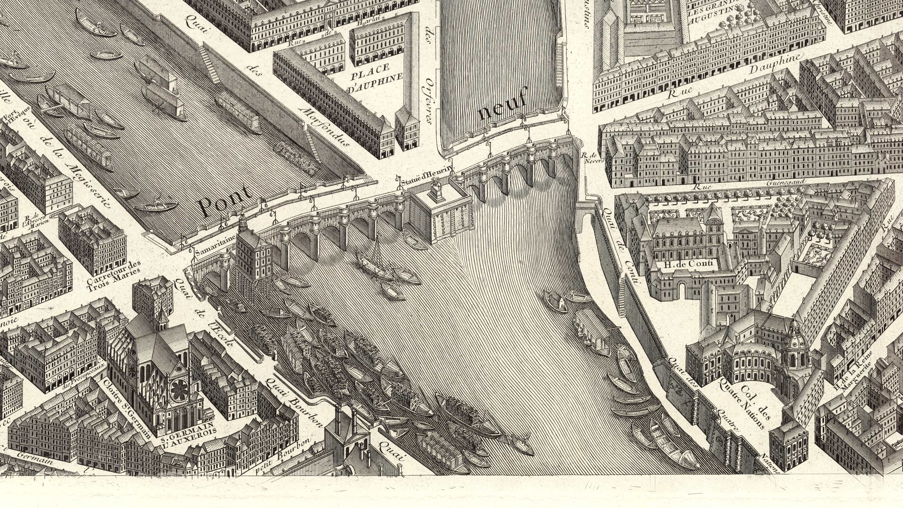
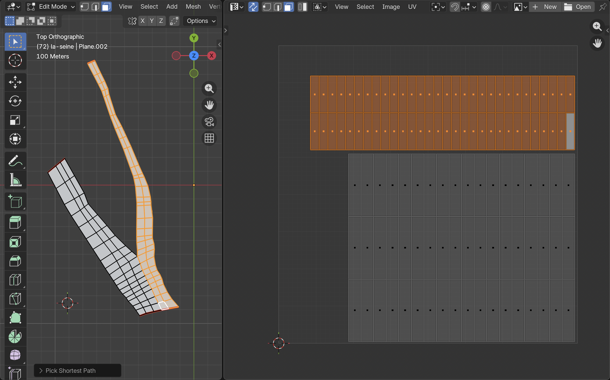

# Water Shader — La Seine

Reference:


Goal: engraving-style flowing streamlines on the la-seine mesh, composited on the shared paper base.

---

## UV Convention (confirmed in Blender)

The la-seine mesh has **two separate UV islands**, one per arm of the Y-shape.



| UV axis | Meaning                            |
| ------- | ---------------------------------- |
| UV.x    | Along-flow (upstream → downstream) |
| UV.y    | Cross-river (bank → bank, 0 to 1)  |

The two islands do not share UV space. The shader treats each arm independently. They visually merge at the tip because the geometry converges — no shader blend logic needed.

---

## Architecture

Follows the existing pattern exactly (`facade`, `roof`).

```
src/shaders/water/
  waterMaterial.ts          ← factory: createPaperMaterial(waterSurfaceLayersFn)
  waterUniforms.ts          ← all uniforms
  tsl/
    waterLineFunctions.ts   ← core TSL line/flow function
    waterSurfaceLayers.ts   ← SurfaceLayersFn composition

src/shaders/applyWaterShader.ts   ← traverses la-seine, assigns createWaterMaterial()
```

`waterMaterial.ts` is a single line:

```ts
export function createWaterMaterial() {
  return createPaperMaterial(waterSurfaceLayersFn);
}
```

---

## Core Line Formula

**All shader code must be written in TSL** (Three.js Shader Language) — `Fn`, node chaining, no raw GLSL strings. This matches the entire existing shader codebase.

The SurfaceLayersFn receives `wallUV` (the 4th arg in createPaperMaterial) which is the actual mesh UV. **Use `wallUV`, not `uvCoord`** — `uvCoord` is the paper projection UV (not mesh UV).

```ts
import { Fn, float, fract, abs, sin, mix, smoothstep, clamp, fwidth } from "three/tsl";
import { timerLocal } from "three/tsl";
import type { Node } from "three/webgpu";
import { waterUniforms } from "../waterUniforms";

export const waterLineFn = Fn(([base, wallUV]: [Node<"color">, Node<"vec2">]) => {
  const {
    uWaterLineDensity, uWaterLineThickness, uWaterLineStrength,
    uWaterInkColor, uWaterFlowSpeed, uWaterWaveFreq, uWaterWaveAmp,
  } = waterUniforms;

  const t = timerLocal();

  // wavy, animated streamlines — iso-contours of UV.y, wave propagates downstream
  const lineCoord = wallUV.y.add(
    sin(wallUV.x.mul(uWaterWaveFreq).add(t.mul(uWaterFlowSpeed))).mul(uWaterWaveAmp)
  );

  const slot = fract(lineCoord.mul(uWaterLineDensity));
  const p = abs(slot.sub(float(0.5))).sub(uWaterLineThickness.mul(float(0.5)));
  const aa = clamp(fwidth(lineCoord.mul(uWaterLineDensity)), float(1e-4), float(0.4));
  const ink = float(1).sub(smoothstep(aa.negate(), aa, p)).mul(uWaterLineStrength);

  return mix(base, uWaterInkColor, ink).toColor();
});
```

Pattern mirrors `facadeHatchingFn` — same anti-aliasing idiom (`fwidth` + `smoothstep`). `timerLocal()` is a built-in TSL node, no manual uniform update needed.

---

## Uniforms (`waterUniforms.ts`)

| Name                  | Type  | Default   | GUI label             |
| --------------------- | ----- | --------- | --------------------- |
| `uWaterLineDensity`   | float | 8.0       | Density (lines/UV)    |
| `uWaterLineThickness` | float | 0.3       | Thickness             |
| `uWaterLineStrength`  | float | 0.7       | Strength              |
| `uWaterInkColor`      | color | `#2a2a2a` | Ink color             |
| `uWaterFlowSpeed`     | float | 0.05      | Flow speed (0=static) |
| `uWaterWaveFreq`      | float | 3.0       | Wave frequency        |
| `uWaterWaveAmp`       | float | 0.02      | Wave amplitude        |

---

## Integration (`main.ts`)

In the la-seine loader block, after `models.laSeine` is assigned:

```ts
import { applyWaterShader } from "./shaders/applyWaterShader";

loader.load("./models/buildings/la-seine.glb", (gltf) => {
  scene.add(gltf.scene);
  models.laSeine = gltf.scene.getObjectByName(OBJECTS.SEINE)!;
  models.laSeine.position.y = 0;
  applyWaterShader(models.laSeine);
});
```

`applyWaterShader` follows `applyPaperShader`: traverse, check `instanceof THREE.Mesh`, assign `createWaterMaterial()`.

---

## GUI (`gui.ts`)

Add `laSeine` to `GuiModels`. Add a `"Water / La Seine"` folder to the inspector (closed by default), mirroring the hatching folder pattern:

```ts
const water = scene.addFolder("Water / La Seine").close();
water.add(waterUniforms.uWaterLineDensity, "value", 1, 30).name("Density (lines/UV)");
water.add(waterUniforms.uWaterLineThickness, "value", 0.01, 0.5).name("Thickness");
water.add(waterUniforms.uWaterLineStrength, "value", 0, 1).name("Strength");
water.add(waterUniforms.uWaterFlowSpeed, "value", 0, 0.5).name("Flow speed");
water.add(waterUniforms.uWaterWaveFreq, "value", 0, 20).name("Wave frequency");
water.add(waterUniforms.uWaterWaveAmp, "value", 0, 0.1).name("Wave amplitude");
const waterColor = { ink: `#${waterUniforms.uWaterInkColor.value.getHexString()}` };
water
  .addColor(waterColor, "ink")
  .name("Ink color")
  .onChange((hex) => waterUniforms.uWaterInkColor.value.set(hex));
```

---

## Implementation Steps

1. `src/shaders/water/waterUniforms.ts` — define all 7 uniforms
2. `src/shaders/water/tsl/waterLineFunctions.ts` — `waterLineFn` (takes `base`, `wallUV`, returns color)
3. `src/shaders/water/tsl/waterSurfaceLayers.ts` — `waterSurfaceLayersFn` conforming to `SurfaceLayersFn` signature
4. `src/shaders/water/waterMaterial.ts` — factory
5. `src/shaders/applyWaterShader.ts` — mesh traversal
6. `src/main.ts` — import and call `applyWaterShader`, add `laSeine` to models passed to GUI
7. `src/ui/gui.ts` — add `GuiModels.laSeine`, add water folder

---

## Notes

- **TSL only**: every function must be a TSL `Fn(...)` node. No raw GLSL strings. Imports come from `three/tsl`; types from `three/webgpu`. See `facadeHatchingFn` as the canonical reference.
- **`wallUV` not `uvCoord`**: the surface layers function receives `uvCoord` (paper projection) as arg 2 and `wallUV` (mesh UV) as arg 3. Water lines must use `wallUV`.
- **`time` node**: use `timerLocal()` from `three/tsl` — it's a built-in TSL node, no manual uniform update needed.
- **Paper + imperfections inherited for free** via `createPaperMaterial()`.
- **No merging logic**: two UV islands naturally produce two independent line patterns that visually converge at the geometry tip. Correct and expected.
- **Step later**: line thickness variation bank-to-center (thicker near banks), noise-based wobble for handmade feel, density ramp toward Pont Neuf merge point.
