# Workflow from QGIS to Blender to GLB

Full pipeline documentation from QGIS to GLB file. The goal is to be able to reproduce this worklow from scratch without any knowledge.

Each step with the tools used and exchanged formats

# QGIS

Goal: create a floor map with shapes of buildings containing meta data about height and type of roof for example.

## Setup the QGIS environment

### Paris with Turgot zone and rotation

- Import a layer of actual paris, for example OSM (Open Street Map) layer.
- Rotate canvas `-142.5°` because the Turgot map is not oriented North - South
- Import and position an image of the Turgot map, make the image invisible and create an outline effect to see the area covered (blue outline)
- ESPG 3857 (same as OSM) to have a standard projection


### Layer Verniquet

Verniquet map is a very accurate floor map from 1775-1789, it will help to draw the shapes from this era.

Import the rasters and apply an effect to make the white transparent. This way you'll only have drawings and you can see under the layer to compare.

`Layer properties -> transparency` and set **white** values to **transparent** with values in screenshot:

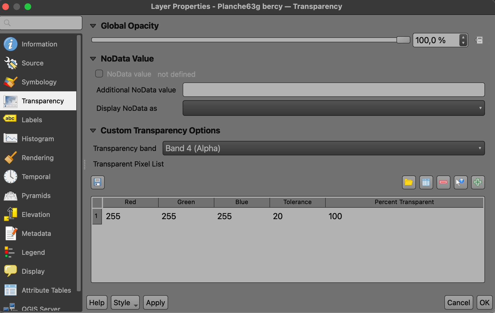

#### Batch apply transparency style on multiple rasters

You can save this property setting (`.qml`) and apply batch this effect on multiple layers by using the plugin **MultiQml**.

To run the batch, you must go under `Vector > Batch vector layer saver`.

See [https://verniquet.fr](https://verniquet.fr)

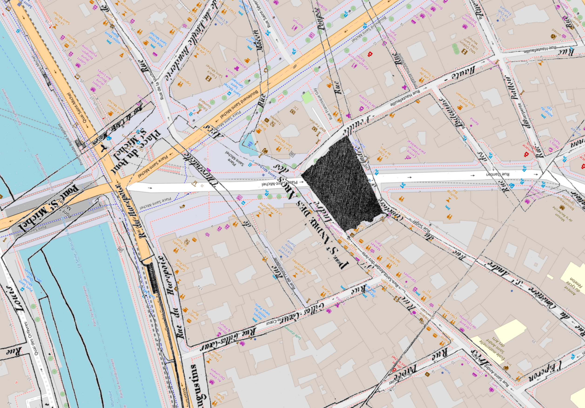

### Layer with modern Paris

Not mandatory but it can help you.
Get the dataset **Emprises bâties et non baties** from [opendata.paris.fr](https://opendata.paris.fr/explore/dataset/emprise-batie-et-non-batie/map/?location=18,48.8615,2.34499&basemap=jawg.streets)

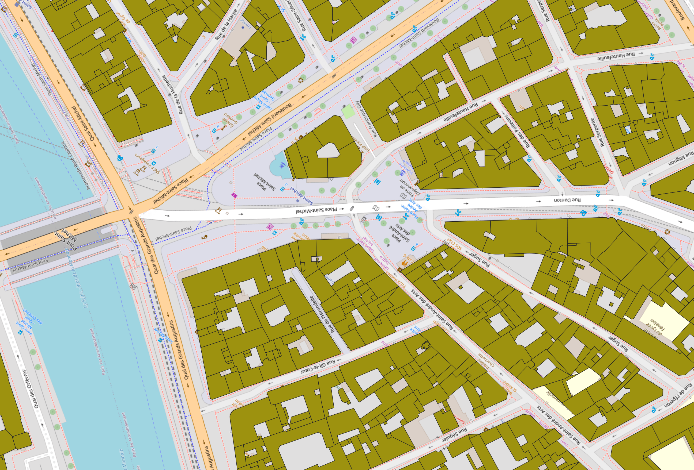

### Vasserot emprise de la voierie (1810-1836)

Can be useful, the precise [dataset from Vasserot (1810-1836)](https://alpage.huma-num.fr/donnees-sig/)

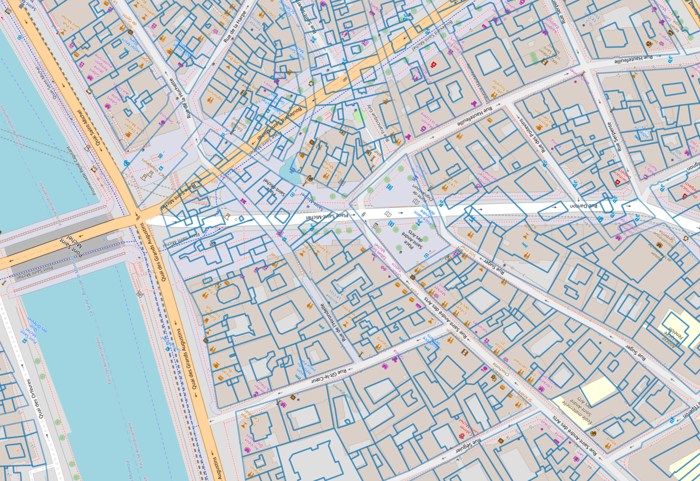

### Position a Turgot sheet

I recommend to position the full _assemblage_ of the 20 sheets first with a bad quality image to avoid performance issue and it will help position each sheet individually. Don't forget this map cheats about street widths and other things so don't try to be too accurate.


## Draw shapes in QGIS

1. **New shapefile layer**

   Don't forget to save the shape file somewhere in your computer)

   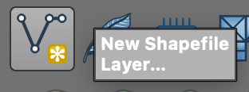

2. **Toggle editing**

   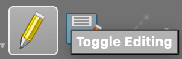

3. **Add polygon**

   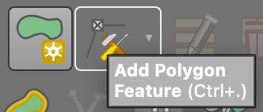

4. **Add vertex on polygon**

   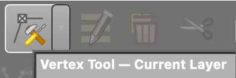

   Select `Vertex tool` and Hold `Shift` and double click on a line.

5. **Delete vertex on polygon**

   Select `Vertex tool`, click on a vertex and `fn + delete` (MacOS)

6. **Unselect feature (shape)**

   When the feature is selected (yellow):
   `cmd + shit + A` to unselect it.

   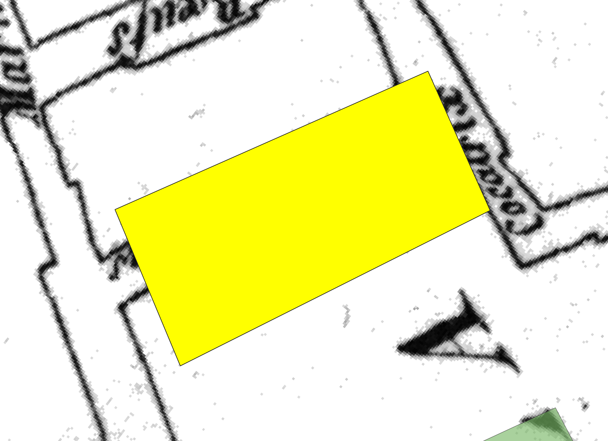

## Add meta data to each shape

`Shape layer properties` (double click on layer or right click) -> `Fields` -> `New field`.

Enter `height` for example, as decimal type.

Then, you can for each shape add a number for the height.Display the attributes (fields) table to edit each shape. Tip: clicking the row number on the left will highlight the feature you are editing.

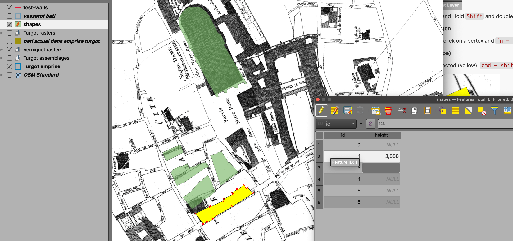

## Export shapes as .shp file

In QGIS, right click on the `shape layer > Export > Save features as...`

Then chose a location for the file and select the attributes.

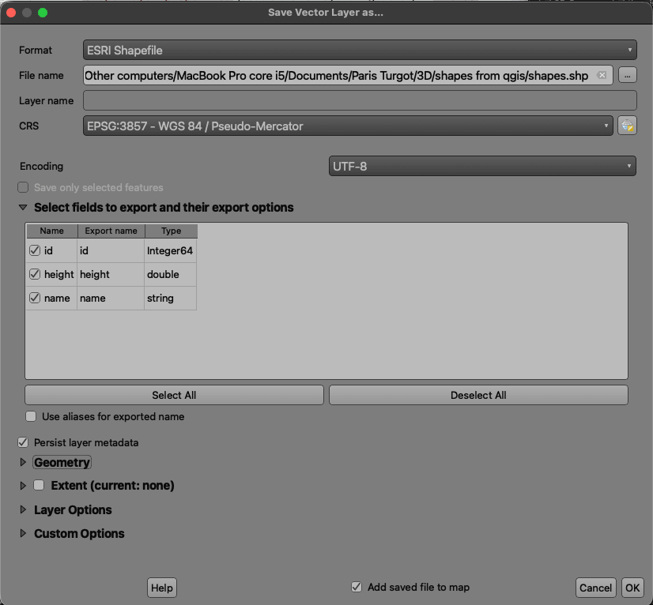

# Blender

## Import shapes into Blender

In Blender, install [BlenderGIS](https://github.com/domlysz/blendergis).

Then `GIS > Import > Shapefile (.shp)`

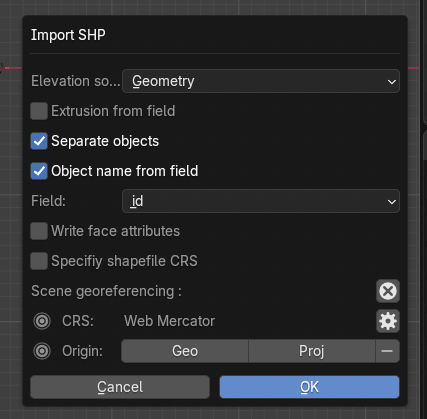

## Copy shapes attributes into Blender's object data attributes

We can not read directly the shape attributes with Geometry nodes, we must first copy them from "Object Custom Properties" to "Object data attributes".

Check you can see QGIS shape attributes as **Custom Properties** in Blender.

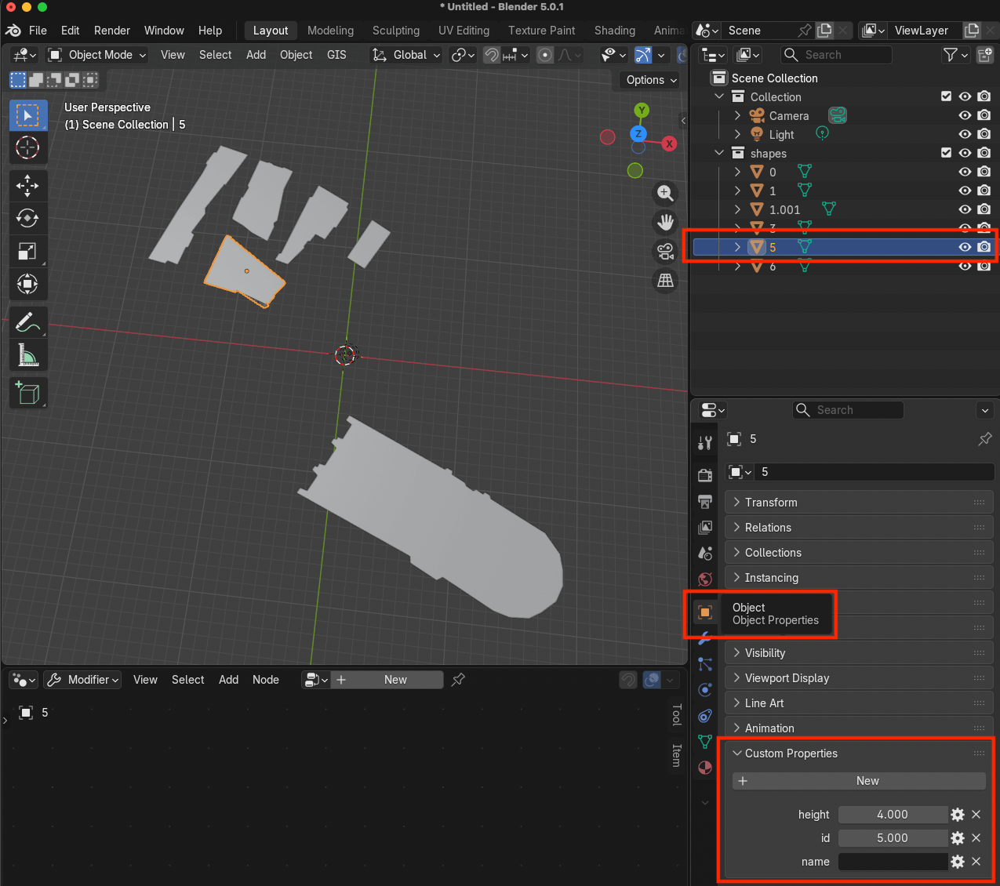

Open Blender text editor, create a **new text** and paste the following code in it. Run it once (1) and a button will appear in the sidebar (shortcut `N`). Open the `Turgot` tab (2), then run the script by clicking `Sync SHP attributes` (3).

You have copied the attributes in the Data section of each object (4). These can be read by Geometry nodes!

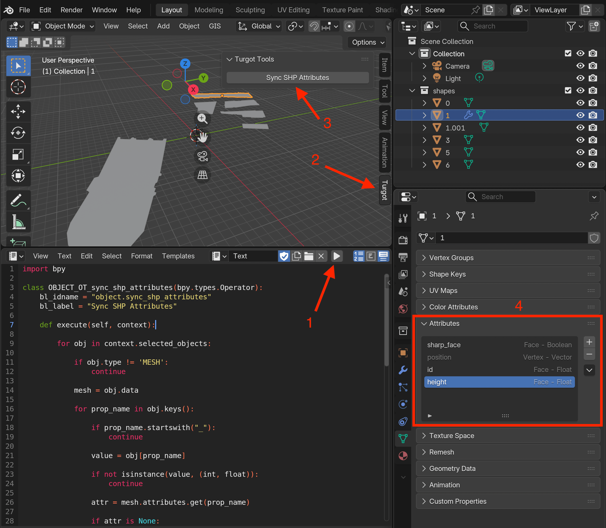

#### Script to be copied in the text editor:

```python
import bpy

class OBJECT_OT_sync_shp_attributes(bpy.types.Operator):
    bl_idname = "object.sync_shp_attributes"
    bl_label = "Sync SHP Attributes"

    def execute(self, context):

        for obj in context.selected_objects:

            if obj.type != 'MESH':
                continue

            mesh = obj.data

            for prop_name in obj.keys():

                if prop_name.startswith("_"):
                    continue

                value = obj[prop_name]

                if not isinstance(value, (int, float)):
                    continue

                attr = mesh.attributes.get(prop_name)

                if attr is None:
                    attr = mesh.attributes.new(
                        name=prop_name,
                        type='FLOAT',
                        domain='FACE'
                    )

                for face in attr.data:
                    face.value = float(value)

        self.report({'INFO'}, "Attributes synchronized")
        return {'FINISHED'}


class VIEW3D_PT_turgot_tools(bpy.types.Panel):
    bl_label = "Turgot Tools"
    bl_idname = "VIEW3D_PT_turgot_tools"
    bl_space_type = 'VIEW_3D'
    bl_region_type = 'UI'
    bl_category = "Turgot"

    def draw(self, context):
        layout = self.layout
        layout.operator("object.sync_shp_attributes")


def register():
    bpy.utils.register_class(OBJECT_OT_sync_shp_attributes)
    bpy.utils.register_class(VIEW3D_PT_turgot_tools)

def unregister():
    bpy.utils.unregister_class(VIEW3D_PT_turgot_tools)
    bpy.utils.unregister_class(OBJECT_OT_sync_shp_attributes)

register()
```

## Extrude simple buildings with Geometry nodes

Join objects together: select all in the viewport and `cmd + J`. You should have only one object and now we can extrude building by reading their `height` attribute with Geometry nodes.

Open the Geometry Node editor and create a new one.

Set these Geomtry nodes on the unique object:

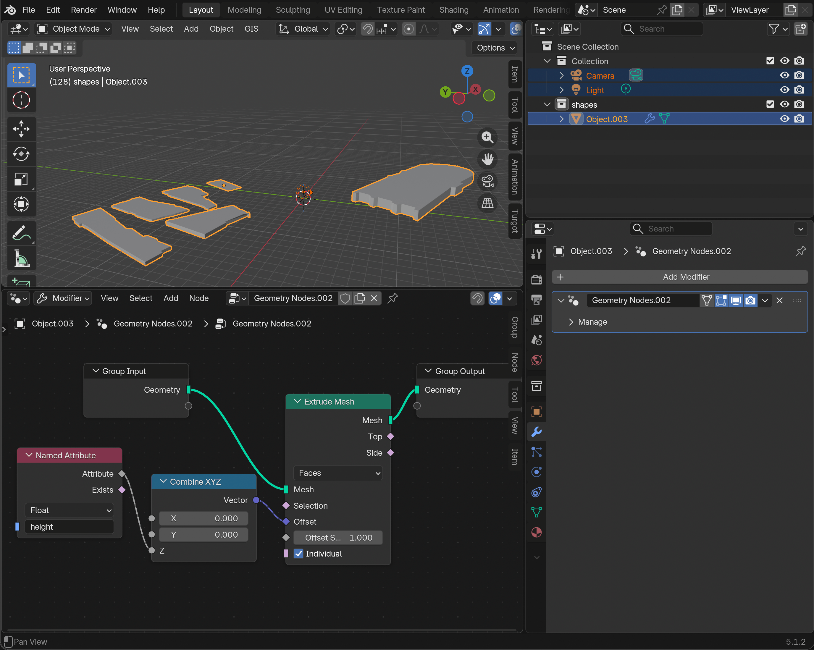

# Blender → GLB Export

## Export

File → Export → glTF 2.0

### Main

- Format: **glTF Binary (.glb)**

### Include

- ☑ Selected Objects

### Transform

- ☑ +Y Up
- ☑ Apply Modifiers

### Geometry

- ☑ UVs
- ☑ Normals
- ☑ Vertex Colors
- ☑ Tangents (optional)

### Materials

- ☑ Export Materials

### Compression

- ☐ Draco Compression

### Animation

- ☐ Animations
- ☐ Shape Keys
- ☐ Skinning

## Output

- Export as `.glb`
- Place in `public/models/`

<!--
↓
GLB
↓
Three.js
-->
